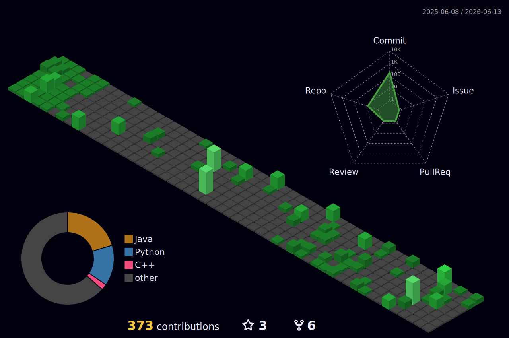

# 👋 Hi, I’m Abin Shaji Thomas  
    

   
   

 
 
--- 

## 📘 About Me

- 😄 Pronouns: **He/Him**  
- 👀 Passionate about **Cyber Security** and **Ethical Hacking** 
- 🎓 Pursuing **B.Tech in Computer Science and Engineering**, specializing in **Cyber Security**   
- 🚀 I love building, breaking, and securing things with code and curiosity!

---

## 🛡️ TryHackMe Progress
 
 

---

### 💻 Programming Languages

---

### ⚙️ Tools, Platforms, Utilities & Cybersecurity

---

### 🌐 Collaboration & Community

> 📌 **Note**: This includes all the languages, tools, platforms, and technologies I’ve worked with in my cybersecurity and development journey.

---

## 📄 Resume

---

## 🏅 Certifications & Badges

🎯 **55+ high-value certifications** and **13 industry-recognized badges** from Microsoft, Cisco, IBM, Infosys, RedHat, and more.

📌 Highlights:
- ✅ Cisco Virtual Internship Certificate (2025)
- ✅ TheRedUsers Cybersecurity Internship Certificate  
- ✅ Mastercard Cybersecurity Job Simulation on Forage  
- ✅ Microsoft SC-900, Cisco Junior Cybersecurity Analyst, IBM Enterprise Security  
- ✅ TryHackMe Advent of Cyber 2025

🔗 **[View Full Certifications & Badges Repository →](https://github.com/Abin-Shaji-Thomas/Certifications-and-Badges)**

  
  
  
  

---

## 📫 Connect with Me

-  
-  
-  
-  

---

> 🔐 “Cybersecurity isn’t just a field — it’s a responsibility. Let’s secure the future, one byte at a time.”  
> — *Abin Shaji Thomas*

## 🔥 Featured Projects

[-View_Project-orange?style=for-the-badge)](https://github.com/Abin-Shaji-Thomas/File-Encryption-and-Decryption-using-C)

[-View_Project-purple?style=for-the-badge)](https://github.com/Abin-Shaji-Thomas/Password-Strength-Checker-In-Java)

