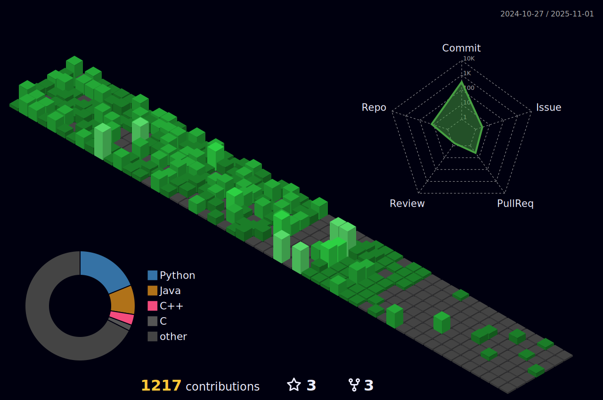

# 👋 Hi, I’m Abin Shaji Thomas

  

## 📘 About Me

- 😄 Pronouns: **He/Him**  
- 👀 Passionate about **Cyber Security** and **Ethical Hacking**  
- 🎓 Pursuing **B.Tech in Computer Science and Engineering**, specializing in **Cyber Security**  
- 🚀 I love building, breaking, and securing things with code and curiosity!

---

## 🏆 Trophy Case

  

---

Here’s a **clean, aesthetic, and well-organized version** of your 🛠️ Tools & Technologies section with grouped categories, matching icons, spacing, and balance. I've split icons logically and made sure all links are functional and consistent.

---
## 🛠️ Tools & Technologies

### 💻 Programming Languages

  
  
  
  

---

### 🐧 Operating Systems & Platforms

  
  
  
  
  
  

---

### 🧰 Tools & IDEs

---

### 🔗 Version Control & Collaboration

  
  
  
  

---

### 📡 Communication Platforms

  

---

> 📌 **Note**: These are all the languages and tools I’ve worked with so far in my journey.

> 📌 **Note**: This list evolves as I explore and master new technologies!

---

## 📊 GitHub Stats

  

---

## 📄 Resume

---

## 🏅 Certifications & Badges

I’m continually learning and upskilling in **Cyber Security** and **Technology**. Check out my achievements:

[🔗 View Certifications & Badges](https://github.com/Abin-Shaji-Thomas/Certifications-and-Badges)

  
  
  

---

## 📫 Connect with Me

- 📧 [abinshajiabin2006@gmail.com](mailto:abinshajiabin2006@gmail.com)
- 💼 [LinkedIn](https://www.linkedin.com/in/abin-shaji-thomas/)
- 📸 [Instagram](https://www.instagram.com/abin_shaji_thomas/)
- 💻 [GitHub](https://github.com/Abin-Shaji-Thomas)

---

> 🔐 “Cybersecurity isn’t just a field — it’s a responsibility. Let’s secure the future, one byte at a time.” 
> — *Abin Shaji Thomas*

